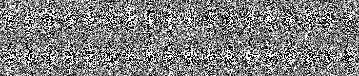

# Generate a visual bitmap from the KISS pRNG

Part two of my coding adventure with the Rust language.  This time,
I write the KISS pseudo random number generator function and create
a bitmap of it's output to see if there are any patterns.

There are probably bugs as always so feel free to send me a PR.

